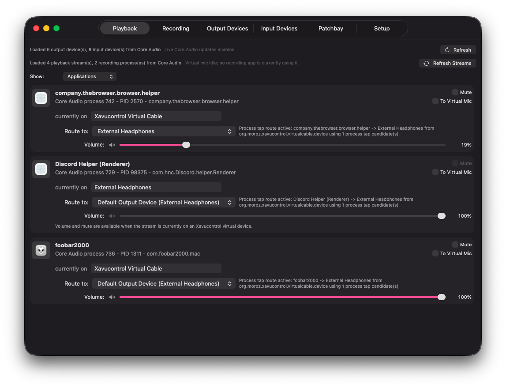
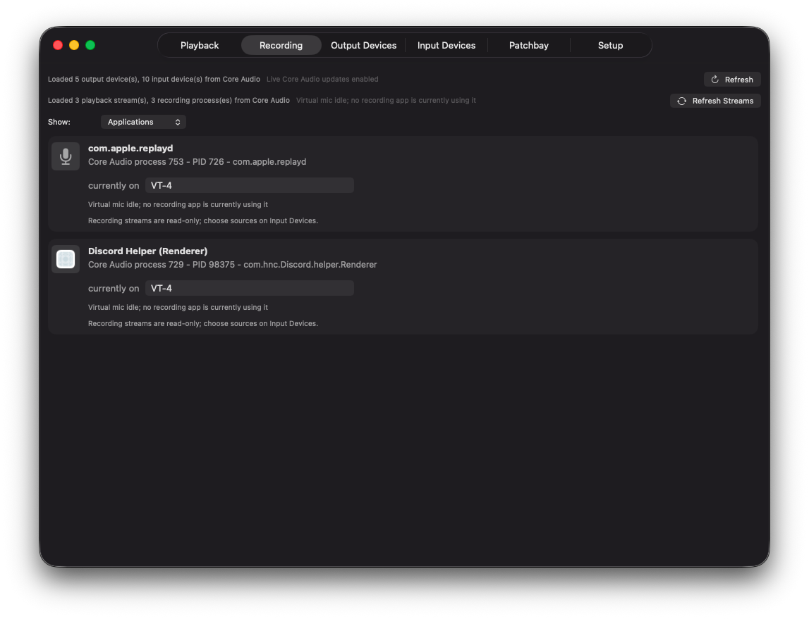
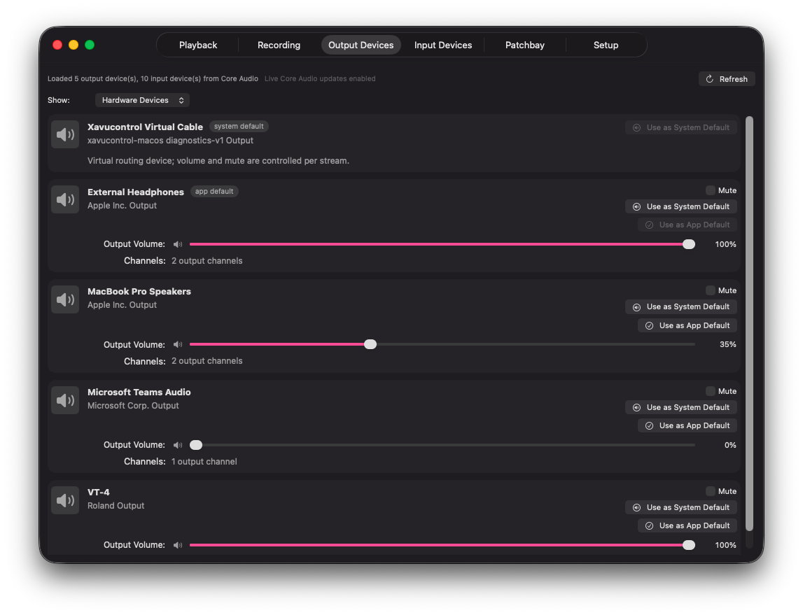
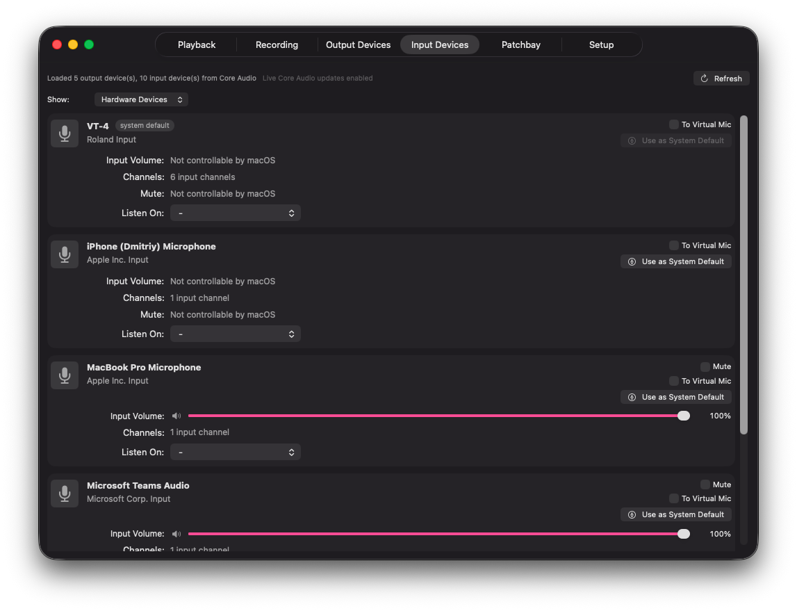
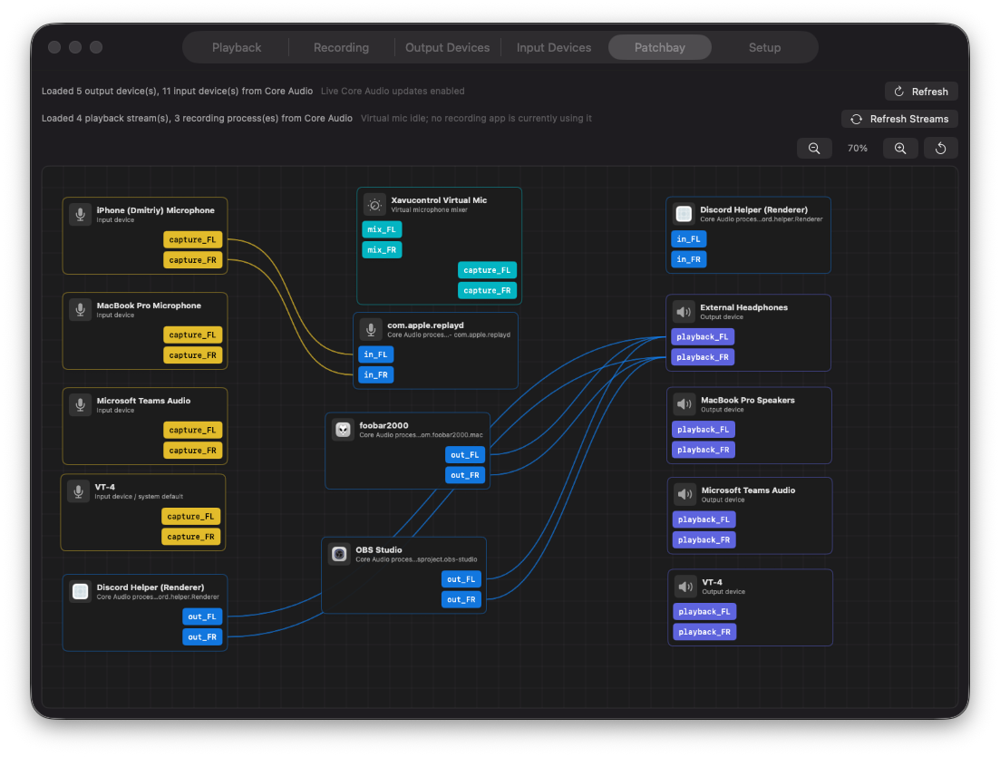
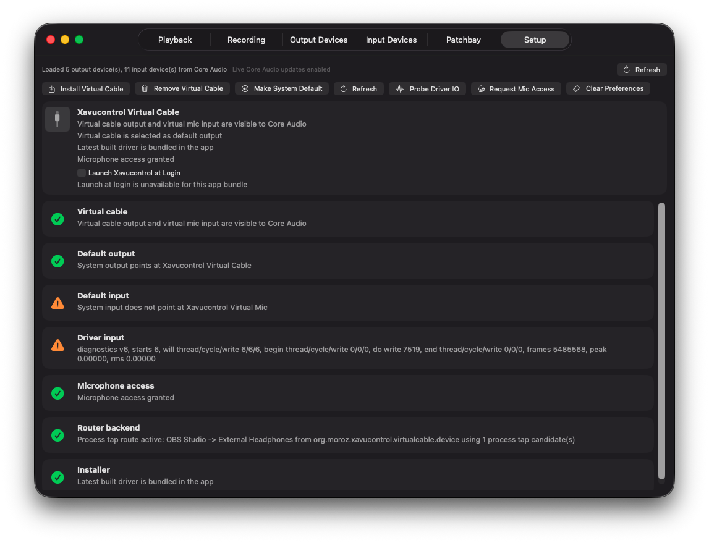
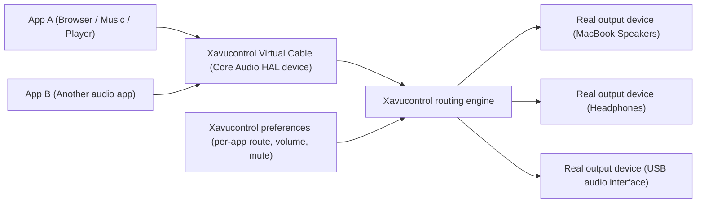
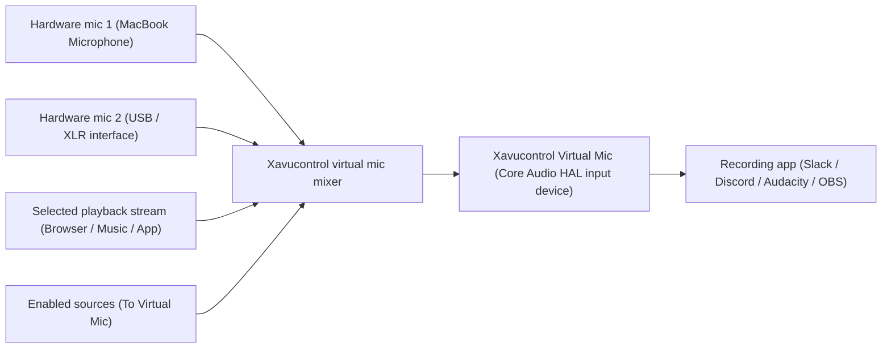
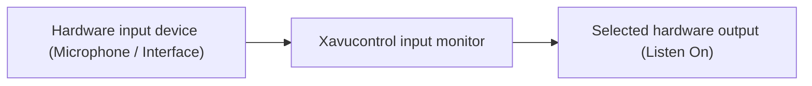

# Xavucontrol

Xavucontrol is a native macOS audio routing and monitoring app inspired by the
Linux `pavucontrol` experience.

It is not affiliated with, endorsed by, or connected to the Linux `pavucontrol`
project, PulseAudio, PipeWire, Apple, or any third-party audio vendor. The name
and UX direction are used to communicate the goal: a practical per-application
audio control panel for macOS.

## Why This Exists

macOS Core Audio is powerful, but normal users still hit a very ordinary wall:
many apps do not let you choose their audio device.

Core Audio gives app developers ways to select input and output devices, but if
an app does not expose that choice in its own UI, the user is stuck with the
system default device. That means simple workflows can become impossible:

- play a browser or YouTube stream through MacBook speakers;
- send Apple Music or foobar2000 to headphones;
- monitor a microphone before recording;
- combine multiple microphones into one virtual microphone;
- mix selected playback audio into a virtual microphone for calls, recording,
  testing, or streaming.

Apps like Slack, Discord, browsers, music players, DAWs, and meeting tools all
behave differently. Xavucontrol exists to put routing control back in one place.

## Project Status

Xavucontrol is early beta-quality software.

The core audio pipeline is functional, but this project includes a custom Core
Audio HAL driver and real-time audio routing code. Expect rough edges, logs,
device-specific behavior, and occasional macOS/CoreAudio weirdness while the
project matures.

## UI / UX Structure

### Playback

Playback is the main per-application routing view. It shows apps that are
currently producing audio, the Core Audio device they are currently on, and the
output device Xavucontrol is routing them to.

When a stream is running through `Xavucontrol Virtual Cable`, the app can manage
its route, volume, mute state, and whether that stream should also be mixed into
`Xavucontrol Virtual Mic`. Streams that are not currently on an Xavucontrol
virtual device remain visible, but controls that cannot actually affect them are
disabled.



### Recording

Recording is intentionally read-only. It shows apps that are currently using, or
attempting to use, microphone input and reports which input device Core Audio
sees for each process.

Microphone source selection is handled on the Input Devices tab instead. This
keeps Recording focused on visibility: it answers "who is recording right now?"
without pretending that macOS exposes PulseAudio-style per-app microphone
routing.



### Output Devices

Output Devices lists every available output device discovered through Core
Audio, including hardware outputs and the Xavucontrol virtual cable. Hardware
devices expose volume and mute controls only when macOS reports that those
properties are settable.

This tab separates two defaults: the macOS system default output and
Xavucontrol's internal app default output. The internal default is used as the
first routing target for playback streams, so a user can keep one system default
while still making Xavucontrol route new streams somewhere else.



### Input Devices

Input Devices shows hardware microphones, virtual microphones, and other Core
Audio input devices. Devices can be made the macOS system default where Core
Audio allows it.

For hardware inputs, `To Virtual Mic` adds that microphone to the shared
`Xavucontrol Virtual Mic` mix. `Listen On` is a monitoring tool: it temporarily
plays a selected input through a selected hardware output so the user can check
gain, noise, tone, or routing before a call or recording.



### Patchbay

Patchbay is a read-only graph view inspired by Helvum and Carla-style routing
patchbays. It shows available input devices, output devices, active playback and
recording streams, virtual devices, and the connections Xavucontrol currently
owns.

The graph is meant for understanding the live audio topology at a glance:
hardware microphones feeding the virtual mic mixer, apps routed to hardware
outputs, input monitoring links, and recording apps attached to input devices.
Connections cannot be edited here yet; routing is controlled from the Playback
and Input Devices tabs.



### Setup

Setup is the maintenance and diagnostics area. It installs or removes the
bundled Core Audio HAL driver, requests microphone access, clears preferences,
sets virtual devices as macOS defaults, and checks whether the routing backend
is healthy.

The diagnostic rows are designed to make driver state visible: whether the
virtual cable and virtual mic are present, whether the system defaults point at
them, whether microphone permission is granted, and whether the router backend
is actively seeing process tap routes.



## Features

- Native macOS SwiftUI app.
- Per-application playback discovery.
- Per-application playback routing to different hardware output devices.
- Internal default output device preference independent from the macOS system
  default.
- Per-stream playback volume and mute for streams routed through Xavucontrol.
- Virtual output device: `Xavucontrol Virtual Cable`.
- Virtual input device: `Xavucontrol Virtual Mic`.
- Multi-source virtual microphone mixer.
- Route selected hardware microphones into `Xavucontrol Virtual Mic`.
- Route selected playback streams into `Xavucontrol Virtual Mic`.
- Read-only Recording tab for apps currently using microphone input.
- Hardware input monitoring with `Listen On`.
- Output and input device controls where Core Audio exposes settable controls.
- System default input/output assignment from the app.
- Read-only Patchbay view inspired by Helvum/Carla-style routing graphs.
- Menu bar mode so routing can continue after the main window is closed.
- Setup tab for installing/removing the bundled virtual audio driver.
- App preferences for remembered routing and virtual mic source choices.

## How The Audio Pipeline Works

Xavucontrol uses a hybrid approach:

- Core Audio device and process APIs discover hardware devices and active apps.
- A bundled Core Audio HAL driver exposes virtual devices to macOS.
- Apps can output into `Xavucontrol Virtual Cable`.
- Xavucontrol captures/processes those streams and plays them to selected real
  outputs.
- Xavucontrol can also mix selected microphones and playback streams into
  `Xavucontrol Virtual Mic`.

### Playback Routing



In this mode, macOS apps send audio to `Xavucontrol Virtual Cable`. Xavucontrol
then routes each detected app stream to the selected real output device.

### Virtual Microphone Mixer



`Xavucontrol Virtual Mic` acts like a shared microphone sink. You choose which
hardware microphones and playback streams should feed it. When an app records
from the virtual mic, Xavucontrol starts the needed captures and mixes them.

### Monitoring Inputs



`Listen On` lets you temporarily monitor a hardware input through a selected
hardware output. This is useful for checking microphone tone, gain, noise, or
interface routing before a recording or call.

## Installation Notes

Xavucontrol requires installing a Core Audio HAL driver. The driver is bundled
inside the app and can be installed from the Setup tab with administrator
permission.

After installing or removing the driver, Core Audio may need to restart. In some
cases, System Settings may keep a stale device list until the Sound pane is
reopened, Core Audio is restarted, or the machine is rebooted.

## Packaging

Build a release DMG locally:

```sh
Scripts/package-dmg.sh
```

The script builds the Release app, renders a branded DMG background, lays out
`Xavucontrol.app` next to an Applications shortcut, and writes the final image
to `dist/Xavucontrol-0.0.1-beta.dmg`.

## License

This project is source-available, not open source.

Copyright (c) 2026 Dmytro Moroz
(https://github.com/ShiftHackZ). All rights reserved.

See [LICENSE.md](LICENSE.md) for the full license terms.
